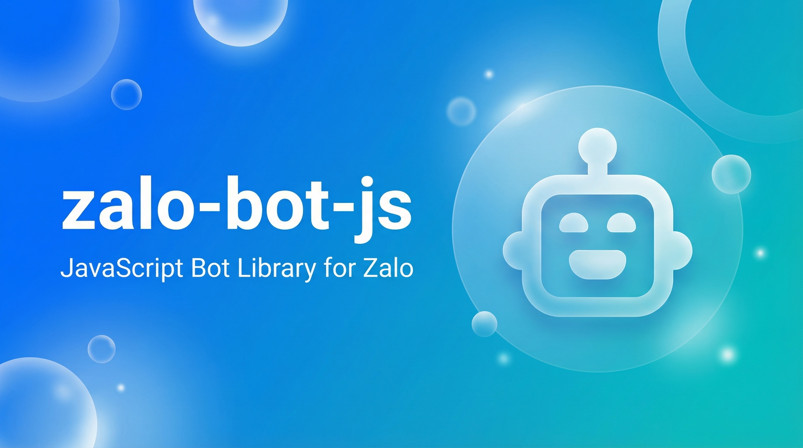

# zalo-bot-js



`zalo-bot-js` is a zero-dependency TypeScript SDK for the Zalo Bot API, designed for Node.js developers who want a clean bot runtime with polling, webhook handling, event listeners, and a TypeScript-friendly structure.

[Docs public](https://kaiyodev.github.io/zalo-bot-js) | [Tiếng Việt](https://kaiyodev.github.io/zalo-bot-js/vi/) | [English docs](https://kaiyodev.github.io/zalo-bot-js/en/)

## What You Get

- A `Bot` client for the Zalo Bot API — zero runtime dependencies
- Event-based message handling with `on()` and `onText()`
- Built-in long polling runtime with `startPolling()`
- Webhook integration through `processUpdate()` and `setWebhook()`
- Sending APIs: `sendMessage()`, `sendPhoto()`, `sendSticker()`, `sendChatAction()`
- Sequential multi-photo helper `sendPhotos()` with indexed captions
- Handler-based APIs with `ApplicationBuilder`, `Application`, `CommandHandler`, `MessageHandler`, and composable `filters`
- Full retry policy, timeout profiles, and request hooks on the HTTP transport layer
- i18n support (`vi` / `en`) for runtime messages

## Who This Is For

This SDK is for developers who want to:

- build a Zalo bot in Node.js or TypeScript with zero dependencies
- start quickly with polling before moving to webhook
- organize bot logic with either event listeners or handler-based APIs
- integrate bot flows with internal services, workflow engines, or external systems

## Installation

```bash
npm i zalo-bot-js
```

## Environment Variables

The SDK reads three variables from `process.env`:

| Variable | Purpose | Required |
|---|---|---|
| `ZALO_BOT_TOKEN` | Bot token from Zalo | Yes |
| `ZALO_BOT_LANG` | Runtime language (`vi` or `en`) | No, defaults to `vi` |
| `ZALO_BOT_ADMIN_ID` | Admin account ID for `bot.isAdmin()` checks | No |

```bash
# Run tests with Node 20+ native .env loading
node --env-file=.env ./dist/test/check-token.js
```

## Quick Start

```ts
import { Bot } from "zalo-bot-js";

const bot = new Bot({ token: process.env.ZALO_BOT_TOKEN! });

bot.on("text", async (message) => {
  if (message.text && !message.text.startsWith("/")) {
    await bot.sendMessage(message.chat.id, `Ban vua noi: ${message.text}`);
  }
});

bot.onText(/\/start(?:\s+(.+))?/, async (message, match) => {
  const payload = match[1]?.trim() ?? "ban";
  await bot.sendMessage(message.chat.id, `Xin chao ${payload}!`);
});

void bot.startPolling();
```

This is the fastest path to a working bot:

- create a bot and get its token from https://bot.zapps.vn/
- set `ZALO_BOT_TOKEN` in your environment
- run polling
- respond to text or commands

Detailed guide: [Getting started (Vi)](https://kaiyodev.github.io/zalo-bot-js/vi/getting-started) · [Getting started (En)](https://kaiyodev.github.io/zalo-bot-js/en/getting-started)

## Admin

Admin is a read-only utility — the SDK does not manage admin lifecycle or modify any files.

```ts
// Set once via env var (recommended)
// ZALO_BOT_ADMIN_ID=your_zalo_account_id

bot.on("text", async (message) => {
  if (!bot.isAdmin(message.fromUser?.id)) {
    return; // non-admin
  }
  await bot.sendMessage(message.chat.id, "Admin-only command");
});

// Check inside a command handler
bot.command("secure", async (message) => {
  if (!bot.isAdmin(message.fromUser?.id)) {
    await bot.sendMessage(message.chat.id, "You are not admin.");
    return;
  }
  await bot.sendMessage(message.chat.id, "Secure command executed.");
});
```

- `bot.getAdminId()` — returns the configured admin ID or `undefined`
- `bot.isAdmin(userId?)` — checks if `userId === adminId`
- `message.admin` — true when `message.fromUser` matches the admin ID

There is **no built-in `/setadmin` or `/id` command**. Set `ZALO_BOT_ADMIN_ID` in your environment before starting the bot.

## Main API Surface

### Bot lifecycle and identity

- `initialize()` — calls `getMe()` to validate the token
- `shutdown()` — closes transport connections
- `cachedUser` — the `User` object returned by the last `getMe()` call
- `getMe()` — fetches bot identity from Zalo API

### Updates and runtime

- `getUpdate()` — fetches a single update
- `getUpdates()` — fetches a batch of updates
- `processUpdate(update)` — routes a raw payload or `Update` through event listeners, `onText`, and `command` handlers
- `startPolling(options?)` — long-polling loop
- `stopPolling()` — graceful stop
- `isPolling()` / `getPollingState()` — runtime state

### Sending

- `sendMessage(chatId, text, opts?)`
- `sendPhoto(chatId, caption, url, opts?)`
- `sendPhotos(chatId, urls[], caption?, opts?)` — sequential fallback with `[N/M]` labels
- `sendSticker(chatId, stickerId, opts?)`
- `sendChatAction(chatId, "typing")`
- `editMessageText(chatId, messageId, text)`
- `deleteMessage(chatId, messageId)`
- `pinMessage(chatId, messageId)` / `unpinMessage(chatId, messageId)`
- `banChatMember(chatId, userId)` / `unbanChatMember(chatId, userId)`
- `promoteChatAdmin(chatId, userId)` / `demoteChatAdmin(chatId, userId)`
- `setChatKeyboard(chatId, keyboardJson)` / `deleteChatKeyboard(chatId)`
- `uploadFile(fileUrl)` / `getFileInfo(fileId)` / `getFileDownloadUrl(fileId)`

### Webhook

- `setWebhook(url, secretToken, options?)` → returns `WebhookResult` with `url`, `updatedAt`, and `verification` status
- `deleteWebhook(options?)`
- `getWebhookInfo(options?)`

### Event listeners

- `bot.on("message" | "text" | "photo" | "sticker" | "command", callback)`
- `bot.once(...)` / `bot.off(...)`
- `bot.onText(regexp, callback)` / `bot.offText(regexp, callback)`
- `bot.command("/name", callback)` — case-insensitive, trims leading `/`
- `bot.onError(handler)` — catches polling fetch errors and listener exceptions

### Message helpers

- `message.replyText(text)`
- `message.replyPhoto(photoUrl, caption?)`
- `message.replySticker(stickerId)`
- `message.replyAction(action)`

### Handler-based API

- `ApplicationBuilder` — fluent builder for `new Application(new Bot(...))`
- `Application` — collects `Handler[]` and runs them on each update (first-match wins)
- `CommandHandler(name, callback)` — routes by parsed command name
- `MessageHandler(filter, callback)` — routes by composable filter predicate
- `filters` — `TEXT`, `COMMAND`, `PHOTO`, `STICKER`, `ALL` with `.and()`, `.or()`, `.not()` chaining
- `CallbackContext` — exposes `bot`, `args`, and `command` inside handler callbacks

The handler/filter API shares the same command parser as `bot.command(...)`, so `/Start  demo` and `/start demo` behave identically across both styles.

## Models

| Model | Key properties |
|---|---|
| `Message` | `messageId`, `date`, `chat.id`, `chat.type`, `text`, `photoUrl`, `sticker`, `fromUser`, `admin` |
| `Update` | `updateId`, `message`, `command`, `eventTypes`, `hasEventType()`, `effectiveUser` |
| `User` | `id`, `displayName`, `accountName`, `isBot`, `canJoinGroups` |
| `Chat` | `id`, `type` |
| `WebhookInfo` | `url`, `updatedAt` |

## Transport & Resilience

- **Retry policy**: configurable `maxAttempts`, `baseDelayMs`, `maxDelayMs`, `jitterRatio`, `retryOn`
- **Timeout profiles**: `short`, `standard`, `long_poll`
- **Request hooks**: `beforeRequest`, `afterResponse`
- **AbortController**: polling loop can be cancelled mid-request

## i18n

```ts
import { t, getLanguage } from "zalo-bot-js";
t("error.invalidTokenInput");
t("app.pollingStarted");
```

Supported languages: `vi` (default), `en`. Controlled by `ZALO_BOT_LANG`.

## Event Shape Example

```ts
import { Bot } from "zalo-bot-js";

bot.on("message", async (message, metadata) => {
  console.log({
    updateId:    metadata.update.updateId,
    chatId:      message.chat.id,
    messageId:   message.messageId,
    fromUserId:  message.fromUser?.id,
    messageType: message.messageType,
    eventTypes:  metadata.update.eventTypes,
    text:        message.text ?? null,
    sticker:     message.sticker ?? null,
    photoUrl:    message.photoUrl ?? null,
  });
});

bot.on("text", async (message) => {
  console.log("[text]", { chatId: message.chat.id, text: message.text });
});

bot.onText(/.*/, async (message, match) => {
  console.log("[onText]", { chatId: message.chat.id, match: match[0] });
});
```

## Webhook Flow

For production-style deployments:

1. register the webhook with `bot.setWebhook(url, secretToken)`
2. expose a public HTTP endpoint
3. validate the `x-bot-api-secret-token` header
4. pass the request body to `bot.processUpdate(payload)`
5. handle the resulting SDK events

Example:

```ts
import { Bot } from "zalo-bot-js";

const bot = new Bot({ token: process.env.ZALO_BOT_TOKEN! });

// Register webhook — returns WebhookResult with verification info
const result = await bot.setWebhook("https://your-domain.com/webhook", "my-secret-token");
if (result?.verification?.ok) {
  console.log("Webhook registered:", result.url);
} else {
  console.error("Webhook verification failed:", result?.verification?.hint);
}
```

See:
- [setWebhook](https://kaiyodev.github.io/zalo-bot-js/en/set-webhook)
- [processUpdate](https://kaiyodev.github.io/zalo-bot-js/en/process-update)
- [Examples](https://kaiyodev.github.io/zalo-bot-js/en/examples)

## Project Structure

- `src/request` — HTTP transport (`BaseRequest` + `FetchRequest`) and API error mapping
- `src/models` — parsed models: `User`, `Chat`, `Message`, `Update`, `WebhookInfo`
- `src/core` — `Bot`, `Application`, `ApplicationBuilder`, `CallbackContext`
- `src/handlers` — `CommandHandler`, `MessageHandler`
- `src/filters` — composable filters (`TEXT`, `COMMAND`, `PHOTO`, `STICKER`, `ALL`)
- `src/i18n` — bilingual runtime messages
- `src/errors` — `ZaloError` hierarchy
- `examples/` — polling and webhook examples
- `test/` — local verification scripts
- `docs/` — VitePress documentation site

## Local Development

```bash
npm run check        # TypeScript type check
npm run build        # compile to dist/
npm test             # check + build + smoke + bot-api
npm run smoke        # export integrity check
npm run test:bot-api # full mock-based API test
```

Test scripts that need a real token require `ZALO_BOT_TOKEN` in the environment:

```bash
node --env-file=.env ./dist/test/check-token.js
node --env-file=.env ./dist/test/hello-bot.js
node --env-file=.env ./dist/test/event-debug.js
```

## Current Scope

The SDK focuses on the practical bot core and the most common message flows.

Known limitations:

- multipart media upload is not yet implemented
- native single-call album send is not available; use `sendPhotos()` as a fallback
- framework-specific webhook adapters (Express, Fastify, Hono, etc.) are not bundled

## License

MIT License. See [LICENSE](./LICENSE) for details.
